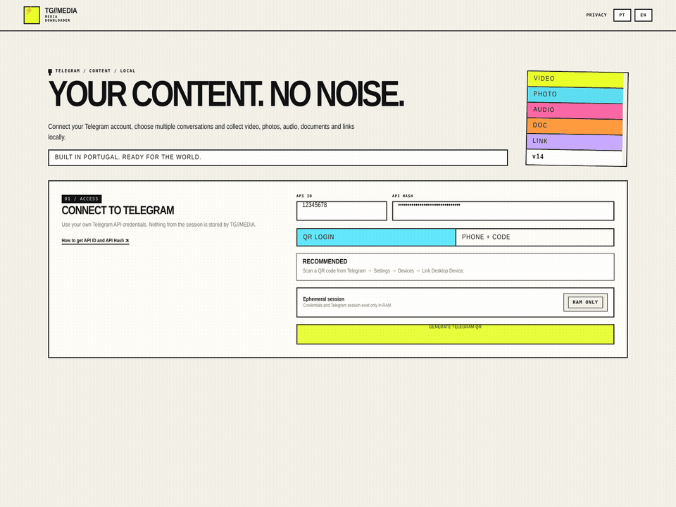
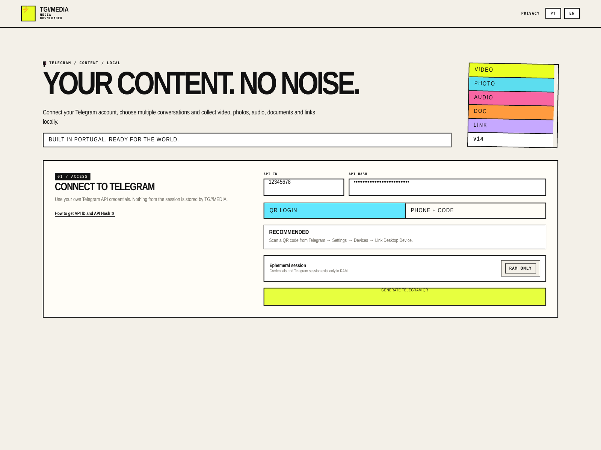
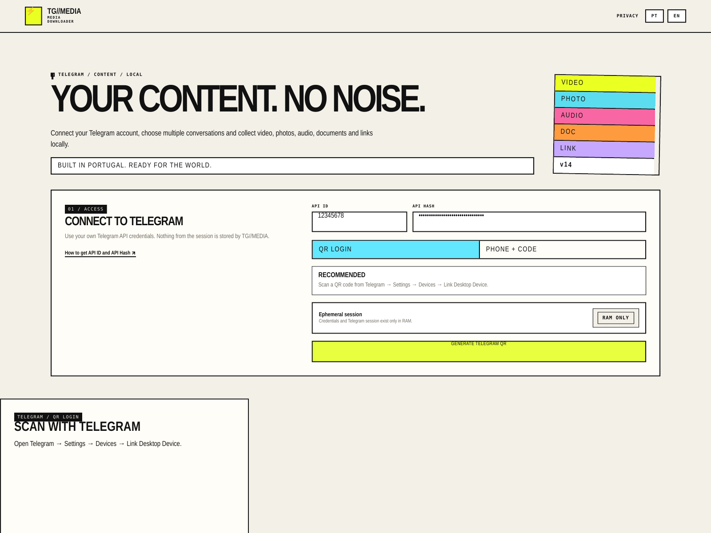
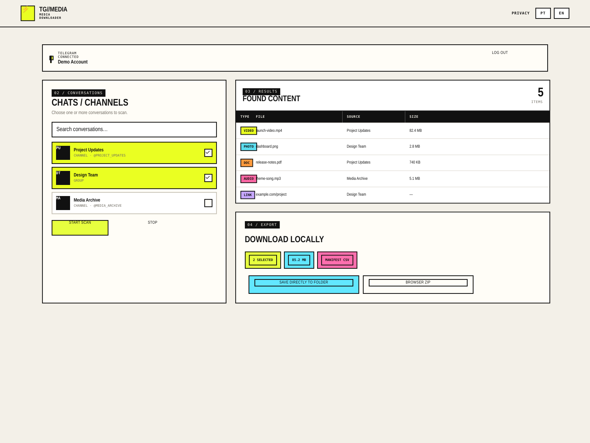
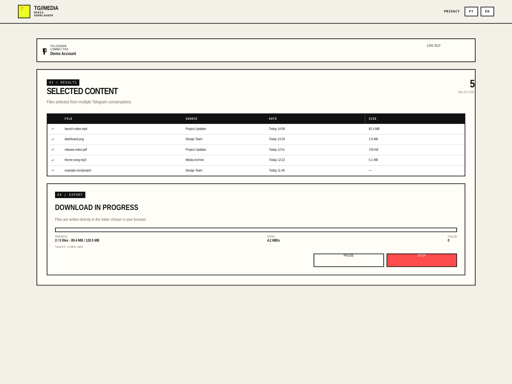
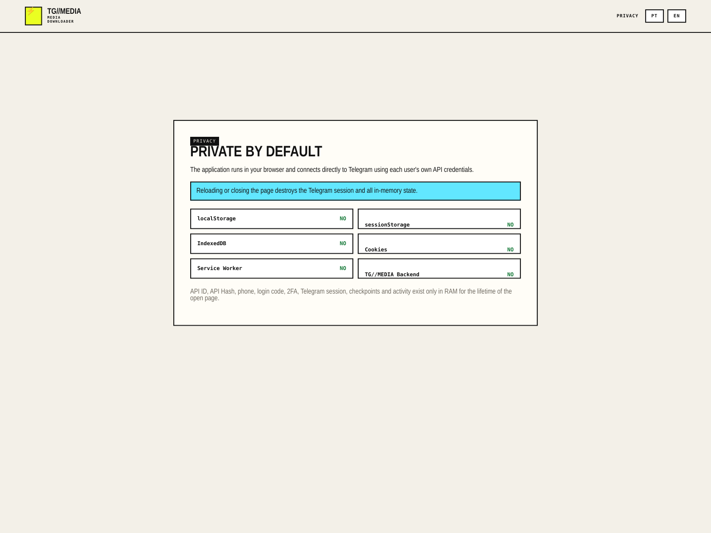

# TG//MEDIA - https://download-videos-telegram.tvcabo.workers.dev/

<p align="center">
  <strong>A single-file, ephemeral Telegram media downloader.</strong><br>
  Each user connects with their own Telegram API ID and API Hash. No TG//MEDIA backend and no persisted Telegram session.
</p>

<p align="center">
  
  
  
  
  
  
</p>

## What it is

TG//MEDIA is a static browser application for finding and exporting content from Telegram conversations that the signed-in user can access.

The **entire application is one file**:

```text
index.html
```

There is no Node server, database, Cloudflare Function, D1 database, VPS or build process required to run the application.

### v14 highlights

- **QR login first** — scan from Telegram → Settings → Devices → Link Desktop Device.
- **Phone + code fallback** remains available.
- Each user supplies their **own API ID and API Hash**.
- Telegram session uses **in-memory storage only**.
- Scan multiple chats/channels sequentially.
- Videos, photos, audio, documents and links.
- Period scans and in-session incremental scans.
- FLOOD_WAIT-aware scan backoff.
- Filter locally without querying Telegram again.
- Direct folder export where supported.
- Split browser ZIP export.
- CSV/TXT export and in-memory Activity.
- English default with PT/EN switch.
- Version card simplified to a **white `v14` tile** matching the surrounding media cards.
- **Built in Portugal. Ready for the world.** is now a prominent part of the product identity.

## Demo

The animation below is built from renders of the **actual v14 interface and CSS** included in this repository. Post-login screens use demo chats/files so no real Telegram account data or credentials are exposed.

<p align="center">
  
</p>

## Screenshots

All screenshots below use the actual TG//MEDIA v14 visual system. Connected/results/download views use safe demo data to show how the application looks after authentication.

### Home / QR-first access



### Telegram QR login



### Connected — chats and scan results



### Local download / export progress



### Ephemeral privacy model



## Privacy model

TG//MEDIA v14 is intentionally ephemeral.

The application does **not** use these mechanisms for Telegram credentials/session state:

```text
localStorage       no
sessionStorage     no
IndexedDB          no
cookies            no
Service Worker     no
application DB     no
TG//MEDIA backend  no
```

API ID, API Hash, phone number, login code, 2FA password, Telegram session, scan checkpoints and Activity exist only in JavaScript memory for the lifetime of the open page.

**Reloading or closing the page destroys the session.**

The application still communicates with:
- **Telegram**, because that is the service being accessed.
- **esm.sh**, which serves the pinned browser libraries used by this single-file build.

Static browser/CDN caching may cache application/library code; that is separate from storing the user's Telegram credentials or session.

## Getting Telegram API credentials

Every user must use their own Telegram application credentials.

1. Open [my.telegram.org/apps](https://my.telegram.org/apps).
2. Sign in with your Telegram account.
3. Open **API development tools**.
4. Create an application if you do not already have one.
5. Copy:
   - `api_id`
   - `api_hash`
6. Paste them into TG//MEDIA.

Do not publish your API Hash, Telegram login codes or 2FA password.

## Sign in

### Recommended: QR

1. Enter your API ID and API Hash.
2. Keep **QR LOGIN** selected.
3. Press **GENERATE TELEGRAM QR**.
4. On your phone open Telegram:
   - **Settings**
   - **Devices**
   - **Link Desktop Device**
5. Scan the QR.

### Fallback: phone + code

Select **PHONE + CODE**, enter the phone number in international format and follow the Telegram verification flow.

Repeated login-code requests can trigger Telegram authentication rate limits. QR login is the recommended default.

## Running locally

Because TG//MEDIA uses browser modules, WebAssembly and Telegram WebSocket connections, serve the file over HTTPS for normal use.

For development, any simple local static server can serve `index.html`.

## Deploy to GitHub Pages

1. Create a repository.
2. Put `index.html` in the repository root.
3. Optionally keep this `README.md` and the `screenshots/` folder.
4. Open **Settings → Pages**.
5. Choose **Deploy from a branch**.
6. Select your main branch and `/ (root)`.
7. Save.

GitHub Pages provides HTTPS automatically.

## Deploy to Cloudflare Pages

No backend configuration is required.

With Git integration:

```text
Framework preset: None
Build command:     leave empty
Build output:      /
```

Or upload a directory containing `index.html` using Cloudflare Pages direct upload.

For the actual application, `index.html` is the only required file.

## Content and export

TG//MEDIA can identify and locally export:

- videos;
- photos/images;
- audio/music;
- voice messages;
- documents/files;
- links shared in messages.

Results are not selected automatically. The user chooses what to export.

For large selections, **Save files directly to folder** is preferred in Chromium-based browsers because it avoids a single large ZIP.

## Telegram rate limits

TG//MEDIA respects `FLOOD_WAIT` during scans and spaces conversation scans sequentially.

Authentication limits are controlled by Telegram. If Telegram returns a long `FLOOD_WAIT` during login, the application cannot bypass it.

Avoid repeatedly starting new phone-code logins. Use QR login where possible.

## Architecture

```text
┌──────────────────────────────┐
│         index.html           │
│ HTML + CSS + application JS  │
└──────────────┬───────────────┘
               │
               ├── pinned @mtcute/web runtime
               ├── pinned @mtcute/core runtime
               └── pinned QR renderer
               │
               ▼
        Telegram MTProto
```

There is no TG//MEDIA server between the browser and Telegram.

## Runtime dependencies

The single-file build dynamically imports pinned versions from `esm.sh`:

- `@mtcute/web@0.31.0`
- `@mtcute/core@0.31.0`
- `qrcode@1.5.4`

They are loaded at runtime so the repository can keep the application itself as a single static HTML file.

## Browser notes

Modern Chrome/Edge are recommended, particularly for direct folder export.

Other modern browsers can use the application, but some filesystem/export capabilities depend on browser support.

## Security

See [SECURITY.md](SECURITY.md).

Important points:
- never hard-code your personal API Hash in a public fork;
- never commit Telegram sessions;
- this build intentionally keeps authentication state in RAM;
- only deploy the file over HTTPS.

## Disclaimer

TG//MEDIA is an independent third-party application that uses the Telegram API. It is not affiliated with or endorsed by Telegram.

Users are responsible for complying with Telegram's terms, applicable law and the rights attached to content they access or export.
